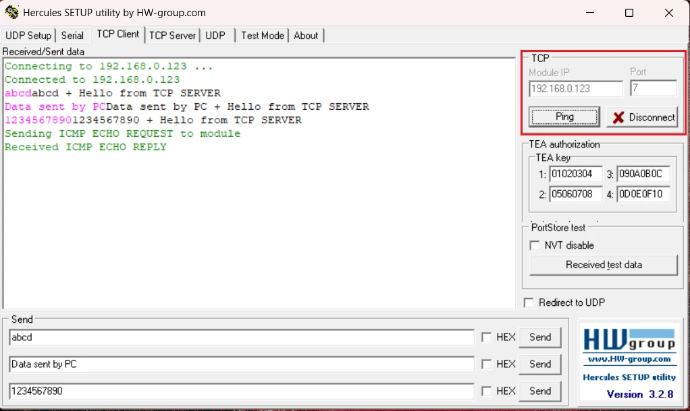

# STM32 Ethernet – TCP Server (Raw API)

This project demonstrates how to implement a **TCP Server** on STM32 using the lwIP Raw API. The STM32 listens on a fixed IP and port, accepts incoming client connections, receives data, appends a response to it, and sends it back. We use Hercules on a PC as the TCP client for testing.

This is **Part 4** of the STM32 Ethernet (lwIP) series.

---

## Features Covered

- Creating a TCP PCB with `tcp_new()`
- Binding to the STM32's local IP and port with `tcp_bind()`
- Putting the server into listen mode with `tcp_listen()`
- Registering an accept callback with `tcp_accept()`
- Handling the connection setup inside `tcp_server_accept()`
- Receiving client data via `tcp_server_recv()`
- Processing and responding to data inside `tcp_server_handle()`
- Proper memory management — allocating and freeing `esTx` and pbufs correctly

---

### TCP Server vs TCP Client

| Role | Who Initiates | STM32 Use Case |
|------|--------------|----------------|
| TCP Server | Waits for client to connect | STM32 receives commands from a PC |
| TCP Client | STM32 reaches out to server | STM32 sends data to a remote server |

---

## Tested On

| Board | Series | Interface |
|-------|--------|-----------|
| Discovery H745 | H7 | MII |

The CubeMX and lwIP configuration is identical to Part 1 of this series. Refer to the `hardware-ping` README for full hardware and CubeMX setup details.

---

## IP Address Configuration

| Device | IP Address | Port |
|--------|-----------|------|
| STM32 (Server) | `192.168.0.123` | `7` |
| PC / Hercules (Client) | `192.168.0.100` | Any |

---

## How It Works

```
1. tcp_new()              -> Create TCP control block (PCB)
2. tcp_bind()             -> Bind PCB to STM32 IP and port 7
3. tcp_listen()           -> Put server into listen mode
4. tcp_accept()           -> Register accept callback
5. tcp_server_accept()    -> Client connects; set up recv, err, poll callbacks
6. tcp_server_recv()      -> Client sends data; store pbuf, call handle
7. tcp_server_handle()    -> Append response and send back to client
```

---

## Key Code

### Initialize the TCP Server

```c
void tcp_server_init(void)
{
    struct tcp_pcb *tpcb;
    tpcb = tcp_new();

    err_t err;
    ip_addr_t myIPADDR;
    IP_ADDR4(&myIPADDR, 192, 168, 0, 123);
    err = tcp_bind(tpcb, &myIPADDR, 7);

    if (err == ERR_OK)
    {
        tpcb = tcp_listen(tpcb);
        tcp_accept(tpcb, tcp_server_accept);
    }
    else
    {
        memp_free(MEMP_TCP_PCB, tpcb);
    }
}
```

### Accept Callback

```c
static err_t tcp_server_accept(void *arg, struct tcp_pcb *newpcb, err_t err)
{
    struct tcp_server_struct *es;
    tcp_setprio(newpcb, TCP_PRIO_MIN);

    es = (struct tcp_server_struct *)mem_malloc(sizeof(struct tcp_server_struct));
    if (es != NULL)
    {
        es->state = ES_ACCEPTED;
        es->pcb = newpcb;
        es->retries = 0;
        es->p = NULL;

        tcp_arg(newpcb, es);
        tcp_recv(newpcb, tcp_server_recv);
        tcp_err(newpcb, tcp_server_error);
        tcp_poll(newpcb, tcp_server_poll, 0);

        return ERR_OK;
    }
    else
    {
        tcp_server_connection_close(newpcb, es);
        return ERR_MEM;
    }
}
```

### Server Handle — Process and Respond

```c
static void tcp_server_handle(struct tcp_pcb *tpcb, struct tcp_server_struct *es)
{
    struct tcp_server_struct *esTx;

    ip4_addr_t inIP = tpcb->remote_ip;
    char *remIP = ipaddr_ntoa(&inIP);

    esTx = (struct tcp_server_struct *)mem_malloc(sizeof(struct tcp_server_struct));
    if (esTx != NULL)
    {
        esTx->state = es->state;
        esTx->pcb = es->pcb;
        esTx->p = es->p;

        static char buf[100];
        memset(buf, '\0', 100);
        memcpy(buf, (char *)es->p->payload, es->p->len);
        strcat(buf, " + Hello from TCP SERVER\n");

        esTx->p->payload = (void *)buf;
        esTx->p->tot_len = (es->p->tot_len - es->p->len) + strlen(buf);
        esTx->p->len = strlen(buf);

        tcp_server_send(tpcb, esTx);

        pbuf_free(es->p);
        mem_free(esTx);
    }
}
```

### main.c

```c
#include "tcpServerRAW.h"
int main(void)
{
    HAL_Init();
    SystemClock_Config();
    MX_GPIO_Init();
    MX_LWIP_Init();

    tcp_server_init();

    while (1)
    {
        MX_LWIP_Process();
    }
}
```

---

## Result

The image below shows Hercules connected to the STM32 TCP server. The pink text is the data sent by the client, and the black text is the response from the server with the appended message.



---

## Full Tutorial and Explanation

Step-by-step explanation, CubeMX screenshots, and video walkthrough available at:

👉 https://controllerstech.com/stm32-ethernet-4-tcp-server/

---

## Related Tutorials

| Part | Topic | Link |
|------|-------|------|
| Part 1 | Hardware Setup, lwIP & Ping Test | https://controllerstech.com/stm32-ethernet-hardware-cubemx-lwip-ping/ |
| Part 2 | UDP Server | https://controllerstech.com/stm32-ethenret-2-udp-server/ |
| Part 3 | UDP Client | https://controllerstech.com/stm32-ethernet-3-udp-client/ |
| Part 5 | TCP Client | https://controllerstech.com/stm32-ethernet-5-tcp-client/ |
| Part 6 | HTTP Web Server (Simple) | https://controllerstech.com/stm32-ethernet-6-http-webserver-simple/ |
| Part 7 | UDP Server using NETCONN (RTOS) | https://controllerstech.com/udp-server-using-netconn-with-rtos-in-stm32/ |

---

## License

This example is provided for educational purposes under Controllerstech Guidelines.
