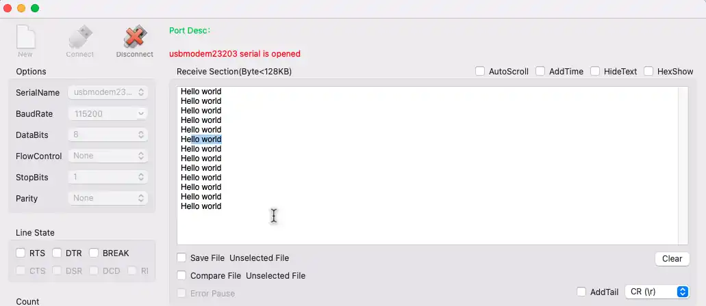

# UART Blocking Transmit – STM32 HAL Example

This project demonstrates how to configure and use UART in **blocking (polling) mode** for data transmission on STM32 microcontrollers using the HAL driver.

In blocking mode, the CPU actively waits until data transmission is complete before proceeding. This is simple to implement and useful for basic UART usage.

---

## Features Covered

- Basic UART initialization using STM32CubeMX / HAL
- Transmit data using `HAL_UART_Transmit()`
- No interrupts or DMA required
- Suitable for simple communication and learning

---

## Tested On

This example has been tested on the following STM32 boards:

- **STM32F103** (F1 series)
- **STM32F407** (F4 series)
- **STM32H743** (H7 series)

The core HAL code is portable across most STM32 MCUs with minor clock/peripheral adjustments.

---

## Development Setup

- **IDE:** STM32CubeIDE
- **HAL Drivers:** Included via CubeMX
- **Project Included:** Complete STM32CubeIDE project folder

---

## 🔌 Connections

If using an external USB-TTL converter:

| STM32 Pin | USB-TTL Pin |
|-----------|------------|
| TX        | RX         |
| GND       | GND        |

> ⚠️ TX connects to RX and RX connects to TX.

If using onboard ST-Link (e.g., Nucleo boards), no external wiring is required.

---

## 🖼 Result

After flashing the code and opening the serial terminal (with the configured baud rate), the transmitted message appears:

---

## How to Use

1. Open the project in **STM32CubeIDE**
2. Verify UART configuration (baud rate, word length, etc.)
3. Build and flash the firmware
4. Open a serial terminal with matching settings
5. Observe transmitted data

---

## Full Tutorial and Explanation

Step-by-step explanation, diagrams, and code walkthrough are available at:

👉 https://controllerstech.com/stm32-uart-1-configure-uart-transmit-data/

---

## License

This example is provided for educational purposes under Controllerstech Guidelines.
