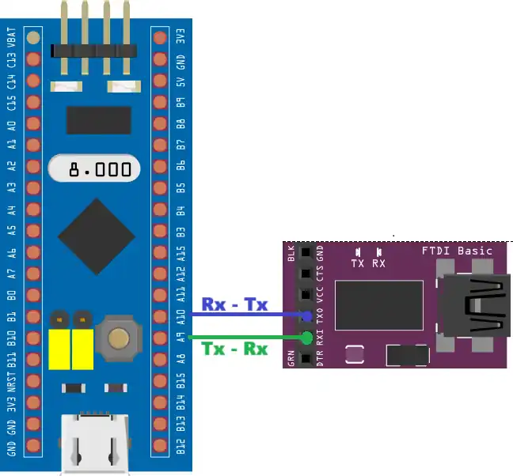
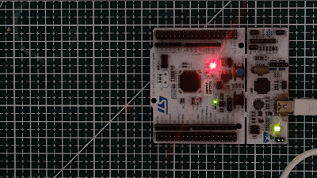

# UART Interrupt & DMA Transmit – STM32 HAL Example

This project demonstrates how to transmit data over UART using **Interrupt** and **DMA** modes on STM32 microcontrollers using the HAL driver.

Unlike blocking mode where the CPU halts until transmission is complete, both Interrupt and DMA modes allow data to be sent in the background — freeing the CPU to handle other tasks simultaneously. This is the second tutorial in the STM32 UART series.

## Features Covered

* Limitations of blocking mode for large data transfers
* Transmit data using `HAL_UART_Transmit_IT()` (Interrupt mode)
* Transmit data using `HAL_UART_Transmit_DMA()` (DMA Normal mode)
* Transmit data continuously using DMA in **Circular mode**
* Using `HAL_UART_TxCpltCallback()` and `HAL_UART_TxHalfCpltCallback()` callbacks
* Double-buffering technique for real-time data updates in circular DMA mode
* Stopping DMA transmission with `HAL_UART_DMAStop()`

## Transmission Mode Comparison

| Feature | Blocking Mode | Interrupt Mode | DMA Mode |
|---|---|---|---|
| CPU Usage | High – waits for each byte | Medium – handles interrupts only | Low – CPU completely free |
| Complexity | Simple | Moderate | Moderate |
| Best For | Small, infrequent data | Medium-size, background tasks | Large data, continuous streaming |
| Real-Time Performance | Poor – blocks other tasks | Good | Excellent |
| HAL Function | `HAL_UART_Transmit()` | `HAL_UART_Transmit_IT()` | `HAL_UART_Transmit_DMA()` |

## Tested On

This example has been tested on the following STM32 boards:

* STM32F103 (F1 series)
* STM32F407 (F4 series)
* STM32H743 (H7 series)

The core HAL code is portable across most STM32 MCUs with minor clock/peripheral adjustments.

## Development Setup

* IDE: STM32CubeIDE
* HAL Drivers: Included via CubeMX
* Project Included: Complete STM32CubeIDE project folder

## 🔌 Connections

If using an external USB-TTL converter:

| STM32 Pin | USB-TTL Pin |
|---|---|
| TX | RX |
| GND | GND |

⚠️ TX connects to RX and RX connects to TX.

If using onboard ST-Link (e.g., Nucleo boards), no external wiring is required.

## CubeMX Configuration

### Interrupt Mode
* Enable UART in Asynchronous mode (same as blocking)
* Enable the **UART global interrupt** in the NVIC tab

### DMA Mode (Normal)
* Add a DMA Request for **USART_TX**
* Direction: Memory to Peripheral
* Data Width: Byte
* Memory Increment: Enabled

### DMA Mode (Circular)
* Same as Normal DMA, but set DMA Mode to **Circular**
* Uses both `HAL_UART_TxHalfCpltCallback()` and `HAL_UART_TxCpltCallback()` for real-time buffer updates

## 🖼 Result

After flashing and opening a serial terminal at the configured baud rate:

* The transmitted data appears continuously in the background
* An LED toggling at a fixed 500 ms rate confirms the CPU is **not** blocked during transmission

## How to Use

1. Open the project in STM32CubeIDE
2. Select the desired transmission mode (Interrupt / DMA Normal / DMA Circular) by enabling the relevant CubeMX configuration
3. Build and flash the firmware
4. Open a serial terminal with matching settings (115200 baud, 8N1)
5. Observe transmitted data and LED behaviour

## Full Tutorial and Explanation

Step-by-step explanation, diagrams, and code walkthrough are available at:

👉 __https://controllerstech.com/stm32-uart-2-use-interrupt-dma-to-transmit-data/__

## Related Tutorials

* **Part 1 – Blocking Transmit:** https://controllerstech.com/stm32-uart-1-configure-uart-transmit-data/
* **Part 3 – Receive Data (Blocking & Interrupt):** https://controllerstech.com/stm32-uart-3-receive-data-in-blocking-interrupt-mode/
* **Part 4 – Receive Data using DMA:** https://controllerstech.com/stm32-uart-4-receive-data-using-dma/

## License

This example is provided for educational purposes under Controllerstech Guidelines.
